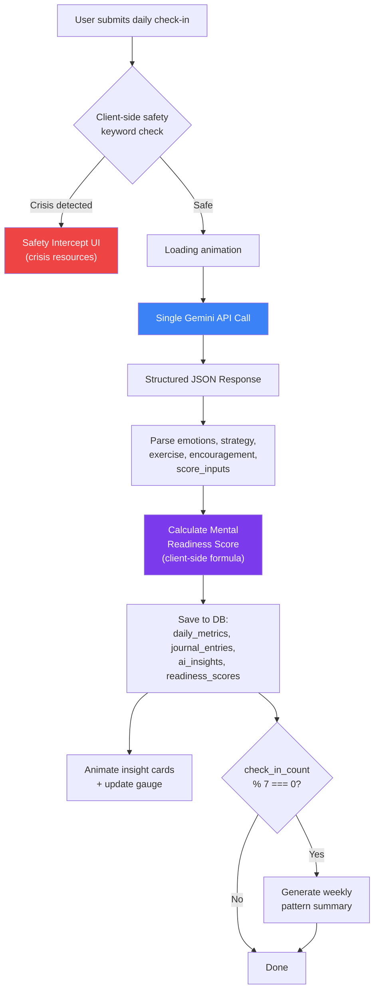
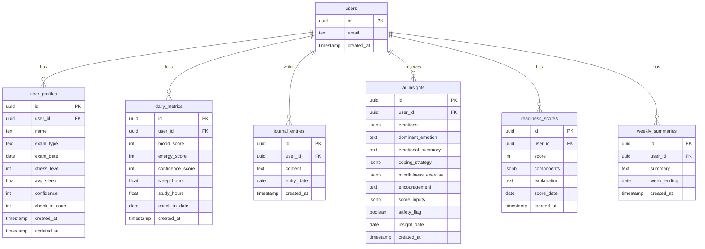

# Product Requirements Document (PRD)

# MindCompass AI
### AI-Powered Mental Wellness Companion for Exam Preparation

**Version:** MVP v3.0 (Hackathon Edition — Refined)
**Platform:** Web Application
**Deployment:** Vercel
**AI Model:** Gemini 2.5 Flash (in-app AI only)
**Target Duration:** 24–48 Hour Hackathon Build
**Team:** 10 parallel agents

---

## Table of Contents

1. [Executive Summary](#1-executive-summary)
2. [Hackathon Build Scope](#2-hackathon-build-scope)
3. [Evaluation Criteria Mapping](#3-evaluation-criteria-mapping)
4. [Problem Statement](#4-problem-statement)
5. [Vision & Goals](#5-vision--goals)
6. [Target Audience](#6-target-audience)
7. [Core Value Proposition & Differentiators](#7-core-value-proposition--differentiators)
8. [User Journey](#8-user-journey)
9. [App Structure & Navigation](#9-app-structure--navigation)
10. [Visual Design System](#10-visual-design-system)
11. [Functional Requirements — Tier 1](#11-functional-requirements--tier-1)
12. [Functional Requirements — Tier 2](#12-functional-requirements--tier-2)
13. [AI Reasoning Architecture](#13-ai-reasoning-architecture)
14. [Safety Requirements](#14-safety-requirements)
15. [Data Model](#15-data-model)
16. [Data Sensitivity & Security](#16-data-sensitivity--security)
17. [Non-Functional Requirements](#17-non-functional-requirements)
18. [Technical Architecture](#18-technical-architecture)
19. [Testing Strategy](#19-testing-strategy)
20. [Accessibility](#20-accessibility)
21. [Demo Narrative](#21-demo-narrative)
22. [Agent Work Distribution](#22-agent-work-distribution)
23. [Decision Log](#23-decision-log)

---

# 1. Executive Summary

MindCompass AI is a Generative AI-powered mental wellness platform for students preparing for high-stakes exams (JEE, NEET, CUET, CAT, GATE, UPSC, Boards). Through daily journaling and mood tracking, Gemini-powered reasoning identifies stress triggers, emotional patterns, and burnout risk, then delivers hyper-personalized coping strategies, mindfulness exercises, and an always-available conversational wellness companion.

**What makes this revision different from v2.0:**
- Every design ambiguity has been resolved through structured brainstorming
- 18 explicit design decisions are documented with rationale
- Agent work-splitting is defined for 10 parallel builders
- Gemini prompt architecture is specified (single-call structured JSON for analysis, streaming for chat)
- Visual design direction is concrete (dark mode, glassmorphism, animated gauge)
- Seed data strategy and demo narrative are tightly coupled

---

# 2. Hackathon Build Scope

Features are split into three tiers. **Tier 1 must work end-to-end and be the spine of the live demo.**

## Tier 1 — Core Demo Path (must be flawless)

1. **Onboarding** — Email/password auth, profile setup
2. **Daily Check-in** — Emoji mood, visual sliders, number inputs, journal
3. **Emotional Analysis Engine** — Single Gemini call → structured JSON
4. **Intervention Engine** — Coping strategy + mindfulness exercise + encouragement (same Gemini call)
5. **Mental Readiness Score** — Pure client-side deterministic formula, animated circular gauge
6. **AI Wellness Companion** — Streaming chat with hybrid context
7. **Safety Intercept** — Dual-layer (client-side keywords + Gemini analysis)

## Tier 2 — Supporting Features (demo with seeded data)

- Trigger Detection Engine
- Hidden Pattern Discovery Engine
- Burnout Prediction Engine
- "What Changed?" Insights

> [!IMPORTANT]
> Seed a sample user with 2–3 weeks of hand-written journal/mood data so Tier 2 features can be demoed convincingly. State this openly in the pitch.

## Tier 3 — Roadmap / Vision (pitch only, not built)

- Voice journaling, mobile apps, wearables integration
- Parent/guardian dashboards
- Production scaling (1,000+ concurrent users)
- Full E2E test suite across all flows
- Advanced predictive forecasting

---

# 3. Evaluation Criteria Mapping

| Criterion | Impact | How We Score |
|---|---|---|
| **Problem Statement Alignment** | High | Complete wellness loop: journal → AI analysis → personalized interventions → hero score → companion chat → safety net. Hindi/Hinglish journal support for real-world Indian student usage. |
| **Code Quality** | High | TypeScript strict mode, clean component architecture, deterministic score function (pure, tested), clear separation of concerns (API routes / components / utils / AI layer). |
| **Security** | Medium | Supabase RLS (user isolation at DB layer), encrypted at rest, env var protection, minimal data sent to Gemini, authenticated routes, data handling disclosure at onboarding. Dual-layer safety intercept. |
| **Efficiency** | Medium | Single Gemini call per check-in (not 3), non-streaming JSON for analysis (faster parsing), streaming for chat only, lean context window (3 days + weekly summary), client-side score calculation. |
| **Testing** | — | Unit tests for Mental Readiness Score (hero metric, pure function). One critical-path E2E test. Manual QA for safety intercept. |
| **Accessibility** | — | Semantic HTML, ARIA labels on all sliders/forms, visible focus states, text labels on color-coded indicators (not color alone), sufficient contrast on dark theme. |

---

# 4. Problem Statement

Students preparing for competitive exams experience chronic stress, burnout, self-doubt, anxiety, fear of failure, and emotional exhaustion. Existing tools rely on static mood logs, generic meditation suggestions, or one-off chatbot replies — none of which understand emotional context, recurring triggers, or longitudinal patterns. Students notice emotional decline only after it has already affected their wellbeing and performance.

---

# 5. Vision & Goals

**Vision:** The most trusted AI wellness companion for students — turning daily reflections into actionable emotional intelligence.

**Primary Goals:** Monitor emotional wellbeing, detect burnout early, surface hidden stress triggers, build self-awareness and resilience, deliver personalized support.

**Secondary Goals:** Encourage consistent reflection habits, improve emotional stability, promote recovery behaviors, reduce exam-related stress.

**Non-Goals:** Clinical diagnosis, therapy replacement, psychiatric treatment, medical advice, academic tutoring.

---

# 6. Target Audience

Students aged 15–30 preparing for JEE, NEET, UPSC, CAT, GATE, CUET, or Board exams. Primarily English and Hindi/Hinglish speakers in India.

---

# 7. Core Value Proposition & Differentiators

| | Traditional Mood Tracker | MindCompass AI |
|---|---|---|
| **Tracks** | Mood, energy | Mood, energy, sleep, confidence, journals |
| **Understands** | Nothing beyond raw numbers | Emotions, triggers, patterns, burnout signals |
| **Provides** | Charts | Personalized insights, coping strategies, adaptive mindfulness, emotional coaching, longitudinal pattern discovery |
| **Language** | English only | English + Hindi/Hinglish (zero extra cost via Gemini) |

### Key Differentiators

1. **Hidden Stress Trigger Discovery** — Surfaces patterns students can't see (sleep deprivation → anxiety spikes, self-comparison language → mock-test anxiety).
2. **Longitudinal Emotional Intelligence** — Reasons over weeks of history, not a single entry.
3. **Hyper-Personalized Support** — Every recommendation draws on journal history, mood/confidence trends, burnout risk, and past intervention outcomes.
4. **Conversational Wellness Companion** — Context-aware, remembers emotional history via insight summaries.
5. **Dual-Layer Safety Net** — Client-side + AI safety intercept works even when the API is down.
6. **Multilingual Journaling** — "Write in English, Hindi, or Hinglish — we understand all."

---

# 8. User Journey

### Step 1 — Sign Up & Onboarding
Email + password sign-up via Supabase Auth. Profile setup form:
- Name
- Exam type (dropdown: JEE, NEET, UPSC, CAT, GATE, CUET, Board Exams)
- Exam date (date picker)
- Current stress level (1–10 slider)
- Average sleep hours (number input)
- Current confidence (1–10 slider)

> [!NOTE]
> "Optional latest mock score" has been **cut** — minimal AI benefit for extra schema/form complexity.

A one-line **data handling statement** is shown: "Your journals are stored securely and never shared. AI analysis uses only your recent entries. This app is not a substitute for professional care."

### Step 2 — Dashboard (Landing Page)
User lands on the Dashboard showing:
- **Hero: Mental Readiness Score** — Animated circular gauge, large and central
- Recent mood/energy trend sparklines
- Latest AI insight summary card
- **"Daily Check-in" CTA button** (prominent if not completed today)
- Tier 2 cards (triggers, burnout risk, "what changed") below — populated from seeded data

### Step 3 — Daily Check-in
User opens the Check-in tab:
- **Mood:** 5 emoji faces (😢 😞 😐 🙂 😄) — maps to 2, 4, 5, 7, 9 internally
- **Energy:** Visual gradient slider (1–10) with color from red to green
- **Confidence:** Visual gradient slider (1–10) with color from red to green
- **Sleep hours:** Number input (0.5 increments)
- **Study hours:** Number input (0.5 increments)
- **Journal entry:** Large textarea, placeholder: "Write in English, Hindi, or Hinglish — we understand all. How was your day? What's on your mind?"

### Step 4 — AI Analysis (Non-Streaming)
On submit:
1. Client-side safety keyword check fires **immediately**. If triggered → safety intercept UI (see Section 14). Flow stops.
2. If safe → Show loading animation ("Analyzing your journal..." with pulsing brain icon).
3. Single Gemini API call with current entry + last 3 days of journals + weekly pattern summary.
4. Response: structured JSON with emotions, coping strategy, mindfulness exercise, encouragement, score component ratings.
5. Mental Readiness Score recalculated client-side from returned components.
6. Insight cards animate in with staggered reveal:
   - Emotional state summary
   - Personalized coping strategy
   - Adaptive mindfulness exercise
   - Motivational encouragement
   - Updated Mental Readiness Score (gauge animates to new value)

### Step 5 — AI Companion (Streaming Chat)
User opens the Companion tab. Persistent chat interface.
- System prompt includes: user profile, latest mood/metrics, latest AI insight summary.
- In-session messages kept in React state (reset on refresh).
- Streaming responses via SSE — text appears word-by-word.
- Example: "Why does this keep happening?" → Companion references seeded history.

### Step 6 — History (Calendar Heat Map)
User opens the History tab.
- Monthly calendar grid, each day colored by Mental Readiness Score (red → yellow → green).
- Unlogged days are gray.
- Click a day → expandable panel showing full journal entry + AI insight for that day.
- At a glance: judges see the emotional arc of the seeded user.

---

# 9. App Structure & Navigation

```
┌─────────────────────────────────────────────┐
│  Sidebar (fixed left)     │  Main Content   │
│                           │                 │
│  🧭 MindCompass AI        │                 │
│  ─────────────────        │                 │
│  📊 Dashboard (active)    │  [Hero Score]   │
│  ✏️  Check-in             │  [Trends]       │
│  💬 Companion             │  [Insights]     │
│  📅 History               │  [Tier 2 cards] │
│                           │                 │
│  ─────────────────        │                 │
│  ⚙️  Profile              │                 │
│  🚪 Sign Out              │                 │
└─────────────────────────────────────────────┘
```

- **4 main tabs:** Dashboard | Check-in | Companion | History
- **Profile** accessible from sidebar bottom
- **Sign Out** at sidebar bottom
- Sidebar collapses to icons on smaller viewports

---

# 10. Visual Design System

### Theme: Dark Mode, Calming & Premium

**Philosophy:** Students study late at night. The app should feel like a safe, calm space — not clinical, not gamified, not overwhelming.

### Color Palette

| Token | Value | Usage |
|---|---|---|
| `--bg-primary` | `#0f0f1a` | Page background |
| `--bg-secondary` | `#1a1a2e` | Card/panel backgrounds |
| `--bg-glass` | `rgba(255, 255, 255, 0.05)` | Glassmorphism cards |
| `--border-glass` | `rgba(255, 255, 255, 0.1)` | Glass card borders |
| `--accent-primary` | `#7c3aed` (violet-600) | Primary actions, active states |
| `--accent-secondary` | `#3b82f6` (blue-500) | Secondary actions, links |
| `--accent-gradient` | `linear-gradient(135deg, #7c3aed, #3b82f6)` | CTA buttons, hero elements |
| `--text-primary` | `#f1f5f9` (slate-100) | Headings, primary text |
| `--text-secondary` | `#94a3b8` (slate-400) | Body text, descriptions |
| `--success` | `#22c55e` | Score high / green indicators |
| `--warning` | `#eab308` | Score medium / yellow indicators |
| `--danger` | `#ef4444` | Score low / red indicators, safety alerts |

### Visual Effects

- **Glassmorphism cards:** `backdrop-filter: blur(16px)`, semi-transparent backgrounds, subtle borders
- **Soft gradients:** On hero score gauge, CTA buttons, slider tracks
- **Micro-animations:** Staggered card reveals (100ms delay between each), score gauge animation (ease-out sweep), hover lift on interactive cards
- **Typography:** Inter (Google Fonts) — clean, modern, excellent readability at all sizes

### Score Gauge Visualization

```
         ╭───────────────╮
        ╱   ╲ 
       ╱     ╲
      │       │
      │  63   │    ← Large number, white, bold
      │       │
       ╲     ╱
        ╲   ╱
         ╰───────────────╯
   "Confidence dipped slightly"    ← One-line explanation
```

- Circular gauge with gradient arc: red (0–30) → yellow (31–60) → green (61–100)
- Number in center, large and bold
- Animate on score change (needle sweep, number counts up/down)
- One-line plain-language explanation below

### Calendar Heat Map

- Grid of day cells, each colored by that day's Mental Readiness Score
- Same red → yellow → green gradient as the gauge
- Unlogged days: `rgba(255, 255, 255, 0.03)` (barely visible)
- Click → expand panel with journal + insight

---

# 11. Functional Requirements — Tier 1

### FR-1: Authentication & Onboarding

**Auth:** Email + password via Supabase Auth.
- Sign-up form: email, password, confirm password
- Sign-in form: email, password
- Protected routes: redirect to sign-in if unauthenticated

**Onboarding:** After first sign-up, redirect to profile setup.
- Fields: name, exam_type (dropdown), exam_date (date picker), stress_level (1–10 slider), avg_sleep (number), confidence (1–10 slider)
- Data handling statement displayed
- On submit → save to `users` and `user_profiles` tables → redirect to Dashboard

**Acceptance:** User can sign up, sign in, complete onboarding, and reach Dashboard. Unauthenticated access is blocked.

---

### FR-2: Daily Journaling & Mood/Wellness Tracking

**Inputs:**
- Mood: 5 emoji faces (😢=2, 😞=4, 😐=5, 🙂=7, 😄=9)
- Energy: Gradient slider (1–10)
- Confidence: Gradient slider (1–10)
- Sleep hours: Number input (0–16, step 0.5)
- Study hours: Number input (0–24, step 0.5)
- Journal: Textarea (min 10 chars, max 5000 chars). Placeholder: "Write in English, Hindi, or Hinglish — we understand all."

**Behavior:**
- One check-in per day. If already completed, show today's insight with an option to view/edit.
- On submit: save metrics to `daily_metrics`, journal to `journal_entries`, then trigger AI analysis.

**Acceptance:** Metrics and journal saved. Historical entries retrievable. One check-in per day enforced.

---

### FR-3: Emotional Analysis Engine (Single Gemini Call)

**Trigger:** After FR-2 submission passes safety check.

**Input to Gemini:**
- Current journal entry + today's metrics
- Last 3 days of journal entries + metrics (if available)
- Weekly pattern summary (if available — generated every 7th check-in)
- User profile (exam type, exam date, days until exam)

**Output (structured JSON):**

```json
{
  "emotions": [
    { "label": "anxiety", "intensity": 0.8, "evidence": "mentions fear of falling behind" },
    { "label": "self_doubt", "intensity": 0.7, "evidence": "compares self to peers" }
  ],
  "dominant_emotion": "anxiety",
  "emotional_summary": "You're carrying a lot of pressure today, especially around peer comparison after mock results.",
  "coping_strategy": {
    "title": "Confidence Reflection",
    "description": "Write down 3 specific topics you've mastered this month...",
    "duration_minutes": 5,
    "target_emotion": "self_doubt"
  },
  "mindfulness_exercise": {
    "title": "Grounding Breath",
    "description": "Close your eyes. Breathe in for 4 counts...",
    "duration_minutes": 3,
    "target_emotion": "anxiety"
  },
  "encouragement": "You've journaled 5 days in a row — that consistency shows real commitment to your wellbeing. Your confidence recovered from a similar dip last Tuesday.",
  "score_inputs": {
    "mood_stability": 0.55,
    "energy_stability": 0.6,
    "burnout_risk": 0.65,
    "confidence_trend": 0.4,
    "recovery_habits": 0.7
  },
  "safety_flag": false
}
```

**Response time:** < 5 seconds.

**Acceptance:** Structured JSON returned with all fields populated. Emotional labels are specific (not generic). Coping strategy targets the detected dominant emotion. Encouragement references at least one concrete data point.

---

### FR-4: Mental Readiness Score (Hero Feature)

**Formula (pure client-side function):**

```typescript
function calculateMentalReadinessScore(inputs: ScoreInputs): number {
  const weights = {
    mood_stability: 0.25,
    energy_stability: 0.20,
    burnout_risk: 0.25,      // inverted: high burnout_risk = low score contribution
    confidence_trend: 0.15,
    recovery_habits: 0.15,
  };

  const raw =
    inputs.mood_stability * weights.mood_stability +
    inputs.energy_stability * weights.energy_stability +
    (1 - inputs.burnout_risk) * weights.burnout_risk +  // invert burnout
    inputs.confidence_trend * weights.confidence_trend +
    inputs.recovery_habits * weights.recovery_habits;

  return Math.round(raw * 100); // 0–100
}
```

**Display:**
- Animated circular gauge (red → yellow → green gradient arc)
- Large score number in center
- One-line explanation below (from `emotional_summary` or a derived explanation)
- Component breakdown visible on hover or in a secondary section

**Day 1 defaults:** If no prior data, Gemini's `score_inputs` from the single first entry are used directly. Stability metrics default to 0.5 (neutral).

**Acceptance:** Score recalculated after every check-in. Displayed prominently on Dashboard. Animation on score change. Pure function is unit-testable.

---

### FR-5: AI Wellness Companion (Streaming Chat)

**Interface:** Full chat UI in the Companion tab.

**System Prompt Context (rebuilt on each message):**
```
You are MindCompass AI, an empathetic wellness companion for {user.name}, 
a student preparing for {user.exam_type} (exam date: {user.exam_date}, 
{days_until_exam} days away).

LATEST EMOTIONAL STATE:
- Mental Readiness Score: {latest_score}/100
- Dominant emotion: {latest_insight.dominant_emotion}
- Emotional summary: {latest_insight.emotional_summary}
- Current mood: {latest_metrics.mood}, Energy: {latest_metrics.energy}
- Sleep: {latest_metrics.sleep_hours}h, Confidence: {latest_metrics.confidence}

RECENT PATTERNS:
{weekly_summary or "No weekly summary yet — this is a new user."}

RULES:
- Reference the student's actual data, not generic advice
- Never diagnose mental health conditions
- Never suggest medication
- If the student expresses self-harm or suicidal thoughts, immediately provide crisis resources and recommend speaking to a trusted adult
- Be warm, validating, and specific
- Keep responses concise (2-3 paragraphs max)
```

**Streaming:** Server-Sent Events (SSE) via Next.js Route Handler. Text appears word-by-word.

**Memory:** In-session messages stored in React state. On new session, chat history resets but the system prompt (with latest insight + profile) provides continuity.

**Acceptance:** Companion responses reference specific data points from the user's history. Streaming works smoothly. Safety rules are followed.

---

### FR-6: Safety Intercept (Dual-Layer)

See [Section 14](#14-safety-requirements) for full specification.

---

### FR-7: Weekly Pattern Summary (Background)

**Trigger:** After every 7th check-in (check_in_count % 7 === 0).

**Process:**
1. Fetch all journal entries + metrics from the last 7 days.
2. Send to Gemini with prompt: "Summarize this student's emotional patterns, recurring triggers, mood trends, and notable changes over the past week. Output as a concise paragraph (100–150 words)."
3. Store the summary in a `weekly_summaries` table.
4. This summary is included in subsequent check-in analysis calls and companion system prompts.

**Acceptance:** Summary generated silently after the 7th, 14th, 21st... check-in. Stored and retrievable.

---

# 12. Functional Requirements — Tier 2

> [!NOTE]
> All Tier 2 features are demoed using seeded data (see Section 21). They run against the same Gemini analysis pipeline but require multi-day history.

### FR-T2-1: Trigger Detection Engine

Identifies recurring triggers from historical journals: mock tests, sleep deprivation, self-comparison, parental expectations, time pressure, subject-specific anxiety.

**Display:** Card on Dashboard showing top 3 triggers with frequency counts.

**Acceptance:** Top 3 triggers displayed from seeded history.

### FR-T2-2: Hidden Pattern Discovery Engine

Surfaces correlations: "Sleep below 6 hours appears before 80% of your highest-stress days."

**Display:** Card on Dashboard with 1–2 pattern insights.

**Acceptance:** At least one pattern insight generated from seeded data.

### FR-T2-3: Burnout Prediction Engine

Classifies burnout risk as 🟢 Low / 🟡 Moderate / 🔴 High based on mood, energy, sleep, sentiment, and confidence trends.

**Display:** Card on Dashboard with colored indicator + **text label** (not color alone) + top contributing factor.

**Acceptance:** Risk level visible with text label and contributing factor named.

### FR-T2-4: "What Changed?" Insights

Explains week-over-week shifts: "Score increased from 58 to 71 because sleep improved by 1.4 hrs/night and journaling consistency rose to 85%."

**Display:** Card on Dashboard with the change explanation.

**Acceptance:** References at least two concrete metric changes.

---

# 13. AI Reasoning Architecture



### Gemini Call Types

| Call | When | Streaming | Input | Output |
|---|---|---|---|---|
| **Check-in Analysis** | After daily check-in | No | Current entry + 3 days history + weekly summary + profile | Structured JSON (emotions, strategy, exercise, encouragement, score_inputs) |
| **Companion Chat** | Each chat message | Yes (SSE) | System prompt (profile + latest insight + weekly summary) + session messages | Free-text response |
| **Weekly Summary** | Every 7th check-in | No | Last 7 days of journals + metrics | Summary paragraph (100–150 words) |
| **Tier 2 Analysis** | On seeded data load | No | Full seeded history | Triggers, patterns, burnout risk, "what changed" |

---

# 14. Safety Requirements

### Layer 1: Client-Side Keyword Check (Instant, No API Dependency)

Fires **before** any Gemini call. Checks the journal text against a curated list of crisis phrases:

```typescript
const CRISIS_PATTERNS = [
  /don'?t want to live/i,
  /want to die/i,
  /kill myself/i,
  /end my life/i,
  /suicide/i,
  /self[- ]?harm/i,
  /no reason to live/i,
  /better off dead/i,
  /can'?t go on/i,
  /want to disappear/i,
  // ... curated list, not exhaustive
];
```

If matched → **immediately** show the Safety Intercept UI. The Gemini call is **not made**.

### Layer 2: Gemini Analysis (Nuanced, Catches Subtler Signals)

The structured JSON response includes a `safety_flag` boolean. Gemini's system prompt instructs:

> "If the journal entry contains any language suggesting self-harm, suicidal ideation, or severe emotional crisis — even indirect expressions like 'I just want everything to stop' or 'nobody would notice if I was gone' — set safety_flag to true."

If `safety_flag === true` → show Safety Intercept UI **instead of** the normal insight cards.

### Safety Intercept UI

When triggered (by either layer):

- **Standard insight cards are NOT shown.** No coping strategy, no mindfulness exercise, no score update.
- Instead, a full-screen calm overlay appears with:
  - A warm, non-judgmental message: "We hear you. What you're feeling is real, and you don't have to face it alone."
  - **Crisis helpline numbers:**
    - iCall: 9152987821
    - Vandrevala Foundation: 1860-2662-345
    - AASRA: 9820466726
  - "Please reach out to a trusted adult — a parent, teacher, or counselor."
  - A "Continue to Dashboard" button (does NOT dismiss the message cavalierly — the resources stay visible).

### Hard Rules for All AI Outputs

- The AI **never** diagnoses mental health conditions.
- The AI **never** suggests medication.
- The AI **never** claims therapeutic authority.
- The AI **never** encourages continued reliance on the app in place of human support.
- The AI **always** validates the student's feelings before offering any suggestion.

> [!CAUTION]
> The safety intercept must be **demonstrated live** during the demo. It is one of the strongest signals of responsible design for a mental wellness challenge.

---

# 15. Data Model



### Key Constraints

- `daily_metrics`: UNIQUE on `(user_id, check_in_date)` — one check-in per day
- `journal_entries`: UNIQUE on `(user_id, entry_date)` — one journal per day
- All tables have `user_id` FK to `auth.users`
- RLS policies: `user_id = auth.uid()` on all SELECT, INSERT, UPDATE

---

# 16. Data Sensitivity & Security

| Concern | Mitigation |
|---|---|
| **Encryption at rest** | Supabase encrypts all data at rest by default. Confirm and state explicitly in pitch. |
| **Row Level Security** | RLS enabled on all tables. Policy: `user_id = auth.uid()`. A user can never read/write another user's records. |
| **Minimal data to Gemini** | Send only: current entry + last 3 entries + weekly summary + profile (no raw IDs, no email). |
| **No third-party analytics of journals** | No logging of raw journal text to any analytics/monitoring service. |
| **Authenticated access** | All API routes check Supabase session. No public routes expose personal data. |
| **API key protection** | Gemini API key and Supabase service role key stored in environment variables. Never exposed client-side. Gemini calls happen server-side via Next.js Route Handlers. |
| **Data handling disclosure** | Shown at onboarding: what's stored, what's sent to AI, that it's not a substitute for professional care. |

---

# 17. Non-Functional Requirements

| Requirement | Target |
|---|---|
| AI response time (analysis) | < 5 seconds |
| AI response time (companion) | First token < 1 second (streaming) |
| Demo reliability | Stable for a 10-minute live demo session |
| HTTPS | Enforced on all routes (Vercel default) |
| Browser support | Latest Chrome, Firefox, Safari (desktop) |

---

# 18. Technical Architecture

```
┌──────────────────────────────────────────────────────┐
│                    Vercel (Deployment)                │
│                                                      │
│  ┌─────────────────────┐  ┌──────────────────────┐   │
│  │   Next.js 15 App    │  │  Route Handlers      │   │
│  │   (TypeScript)      │  │  /api/analyze         │   │
│  │                     │  │  /api/companion        │   │
│  │  Pages:             │  │  /api/weekly-summary   │   │
│  │  - /auth/signin     │  │  /api/seed-data        │   │
│  │  - /auth/signup     │  │                        │   │
│  │  - /onboarding      │  └──────────┬─────────────┘   │
│  │  - /dashboard       │             │                 │
│  │  - /checkin         │             │                 │
│  │  - /companion       │     ┌───────▼───────┐         │
│  │  - /history         │     │  Gemini 2.5   │         │
│  │                     │     │  Flash API    │         │
│  └─────────┬───────────┘     └───────────────┘         │
│            │                                           │
│  ┌─────────▼───────────────────────────────────────┐   │
│  │              Supabase                           │   │
│  │  ┌──────────┐  ┌──────────┐  ┌──────────────┐  │   │
│  │  │   Auth   │  │ Postgres │  │     RLS      │  │   │
│  │  │ (Email)  │  │   (DB)   │  │  (Policies)  │  │   │
│  │  └──────────┘  └──────────┘  └──────────────┘  │   │
│  └─────────────────────────────────────────────────┘   │
└──────────────────────────────────────────────────────┘
```

### Stack

| Layer | Technology |
|---|---|
| Frontend | Next.js 15, TypeScript, TailwindCSS, shadcn/ui |
| Backend | Next.js Route Handlers (API routes) |
| Database | Supabase PostgreSQL with RLS |
| Auth | Supabase Auth (email + password) |
| AI | Gemini 2.5 Flash (Google AI SDK) |
| Deployment | Vercel |
| Font | Inter (Google Fonts) |

### Key Technical Decisions

- **Server-side AI calls only.** All Gemini calls happen in Route Handlers. The API key never reaches the client.
- **Supabase client-side SDK** for auth and data queries (RLS protects data).
- **No state management library.** React state + server state via Supabase is sufficient for this scope.
- **No ORM.** Direct Supabase client queries — simpler, faster to build.

---

# 19. Testing Strategy

> [!IMPORTANT]
> Scoped for hackathon. Maximum value per test-hour invested.

### Unit Tests (Must Have)

**Mental Readiness Score calculation** — the hero metric, a pure function.

```typescript
describe('calculateMentalReadinessScore', () => {
  it('returns 100 for perfect inputs', () => { ... });
  it('returns 0 for worst-case inputs', () => { ... });
  it('correctly inverts burnout_risk', () => { ... });
  it('weights mood_stability at 25%', () => { ... });
  it('returns integer (rounded)', () => { ... });
  it('handles Day 1 default inputs', () => { ... });
});
```

### Critical-Path E2E Test (Must Have)

One Playwright test: Sign up → Complete onboarding → Submit daily check-in → Verify AI insight card appears and Mental Readiness Score is displayed.

### Manual QA (Must Have)

Safety intercept tested with 3 sample phrases:
1. "I don't want to live anymore"
2. "I want to kill myself"
3. "I just want everything to stop" (subtler — tests Layer 2)

**All three must trigger the Safety Intercept UI. 100% pass required.**

---

# 20. Accessibility

Concrete, implementable items (not a generic WCAG checklist):

| Item | Implementation |
|---|---|
| Semantic HTML | `<main>`, `<nav>`, `<section>`, `<article>`, proper heading hierarchy |
| ARIA on sliders | `aria-label`, `aria-valuemin`, `aria-valuemax`, `aria-valuenow` on mood/energy/confidence inputs |
| Focus states | Visible focus rings on all interactive elements. Full check-in flow navigable via keyboard. |
| Color + text labels | Burnout Risk indicator shows "🟢 Low" / "🟡 Moderate" / "🔴 High" — text label, not color alone |
| Score gauge | `aria-label="Mental Readiness Score: 63 out of 100"` on the gauge element |
| Contrast | All text meets WCAG AA contrast on dark background (verified: slate-100 on #0f0f1a = 15.4:1) |
| Emoji mood selector | Each emoji is a radio button with `aria-label="Very sad"`, `"Sad"`, `"Neutral"`, `"Happy"`, `"Very happy"` |

---

# 21. Demo Narrative

### Setup
A seeded user ("Priya", JEE aspirant, exam in 45 days) has 3 weeks of hand-written journal data showing:
- **Week 1:** Optimistic, confident, good sleep (7–8h), score ~72
- **Week 2:** Mock test slump, sleep drops to 5–6h, self-comparison language increases, score drops to ~52
- **Week 3:** Partial recovery, started journaling more consistently, score recovers to ~63

### Live Demo Flow (5–7 minutes)

**1. Dashboard First Impression (30s)**
Judge sees Priya's dashboard: animated score gauge at 63, mood sparkline showing the dip-and-recovery, Tier 2 cards (triggers, burnout risk moderate, "What Changed" explanation).

**2. New Check-in (60s)**
Priya submits today's entry:
> "I studied all day and still feel like everyone else is ahead of me."

Mood: 😞 (4), Energy: 5, Confidence: 3, Sleep: 5.5h, Study: 10h.

Loading animation → Insight cards animate in:
- **Emotions:** Anxiety (0.8), Self-doubt (0.7)
- **Coping:** Confidence Reflection exercise
- **Mindfulness:** Grounding Breath (3 min)
- **Encouragement:** References 5-day journaling streak
- **Score:** Gauge animates from 63 → 60

**3. AI Companion (60s)**
Priya asks: "Why does this keep happening?"
Companion streams a response referencing seeded history: "Your journals show mock-test performance strongly affects your confidence, even when your preparation consistency stays high. This pattern has appeared three times this month..."

**4. Hindi Journal Demo (30s)**
Quick demo: submit a journal entry in Hindi. Gemini analyzes it perfectly, returns English insights. "Write in any language — we understand all."

**5. History Heat Map (30s)**
Switch to History tab. Calendar shows the green → red → yellow arc. Click on a red day → full journal + insight expands.

**6. Safety Demo (60s)**
Separate test entry: "I don't want to live anymore."
- Client-side keyword check fires instantly
- Standard flow stops
- Safety Intercept UI appears: crisis resources, helpline numbers, "You don't have to face this alone"
- Judge sees the dual-layer safety system in action

**7. Code Quality Walkthrough (60s)**
Quick terminal: run unit tests for Mental Readiness Score (all pass). Show the pure function. Show RLS policies in Supabase. Show TypeScript strict mode. Show the clean component structure.

---

# 22. Agent Work Distribution

With 10 agents building in parallel, here's a recommended work split:

| Agent | Scope | Dependencies |
|---|---|---|
| **Agent 1** | Supabase setup: schema, RLS policies, seed data script | None (do first) |
| **Agent 2** | Auth flow: sign-up, sign-in, protected routes, onboarding form | Agent 1 (schema) |
| **Agent 3** | Dashboard layout: sidebar navigation, page structure, responsive design | None |
| **Agent 4** | Mental Readiness Score: gauge component, animation, pure calculation function + unit tests | None |
| **Agent 5** | Daily Check-in UI: emoji mood selector, gradient sliders, journal textarea, form validation | Agent 1 (schema) |
| **Agent 6** | AI Analysis Route Handler: Gemini prompt, structured JSON parsing, DB save | Agent 1 (schema) |
| **Agent 7** | AI Companion: chat UI, streaming SSE route handler, system prompt builder | Agent 1 (schema) |
| **Agent 8** | Safety intercept: client-side keyword checker, safety UI overlay, Gemini safety_flag handling | None |
| **Agent 9** | History view: calendar heat map, day-expand panel, data fetching | Agent 1 (schema) |
| **Agent 10** | Tier 2 cards: trigger detection, pattern discovery, burnout prediction, "what changed" — all from seeded data | Agent 1 (seed data) |

### Integration Order
1. Agent 1 ships schema + seed data first
2. Agents 2–10 work in parallel
3. Agent 3 (Dashboard) integrates components from Agents 4, 10
4. Agent 5 (Check-in) integrates with Agent 6 (Analysis) and Agent 8 (Safety)
5. Final integration + E2E test

---

# 23. Decision Log

| # | Decision | Choice | Alternatives Considered | Rationale |
|---|----------|--------|------------------------|-----------|
| 1 | Tier 1 scope | All 7 features | Cut companion to Tier 2; Cut to 4 features | Team has 10 agents; all features needed for qualification |
| 2 | Data persistence | Supabase PostgreSQL + RLS | localStorage only; Supabase Auth + localStorage hybrid | Security is Medium Impact criterion; RLS is a strong talking point for mental health data |
| 3 | Gemini call architecture | Single call per check-in → structured JSON | Two calls (analysis + intervention); Three separate calls | Faster (one round-trip ~2-3s), cheaper, simpler |
| 4 | Mental Readiness Score | Pure client-side formula (deterministic) | AI-assisted hybrid; Fully AI-generated | Testable, deterministic, satisfies Testing criterion |
| 5 | Landing page | Dashboard-first with hero score gauge | Journal-first; Companion-first | Hero metric = first impression. Seeded data looks impressive on dashboard |
| 6 | Check-in inputs | Emoji mood + visual sliders + number inputs | All sliders (1–10); Conversational intake | Lower cognitive load, more engaging, accessible, quick to build |
| 7 | Safety intercept | Dual-layer: client-side keywords + Gemini analysis | Client-side only; Gemini only | Client-side = instant, no API dependency. Gemini = catches subtler signals. Both = strongest demo. |
| 8 | Navigation | Sidebar tabs (Dashboard, Check-in, Companion, History) | Full page navigation; Wizard-style flow | Clean, professional, fewer routes, faster transitions |
| 9 | Companion context | Hybrid: session messages in React state + system prompt with latest insight + profile | Full conversation history in DB; Session-only with no context | Avoids schema/pagination complexity while maintaining "longitudinal memory" through insight summaries |
| 10 | Seed data | Hard-coded JSON file, hand-written, loaded via Supabase seed script | Gemini-generated; Gemini-generated then curated | Full control over narrative arc for demo |
| 11 | Score visualization | Animated circular gauge with red→green gradient | Radial progress ring with components; Card-based with bar chart | Single bold focal point, intuitive color gradient, animation creates demo "wow" moment |
| 12 | History view | Calendar heat map (score-colored days, click-to-expand) | Chronological list; Vertical timeline | Most visually impactful, shows emotional arc at a glance, unique differentiator |
| 13 | AI streaming | Streaming for Companion chat only; non-streaming for analysis | Full streaming everywhere; No streaming anywhere | Structured JSON can't be streamed meaningfully; chat benefits from perceived speed |
| 14 | Auth method | Email + password via Supabase Auth | Google OAuth only; Google OAuth + email fallback | Team preference; provides full control |
| 15 | Language support | English UI + Hindi/Hinglish journal support | English only; Full bilingual UI | Zero extra dev cost (Gemini handles natively), powerful demo moment, real-world applicability |
| 16 | Visual design | Dark mode, calming blues/purples, glassmorphism, Inter font | Light mode with warm pastels; Adaptive dark/light | Students study at night; dark mode is practical. Blues/purples = calm + trust. Glassmorphism = premium. |
| 17 | Gemini context per check-in | Last 3 days raw journals + weekly pattern summary | Last 7 days raw; Current entry + latest insight only | Balances context (longitudinal reasoning) with token efficiency (~1500 tokens of history) |
| 18 | Weekly summary trigger | Every 7th check-in | Nightly cron; Lazy generation when summary is stale | Simple, predictable, no external scheduling dependency |
